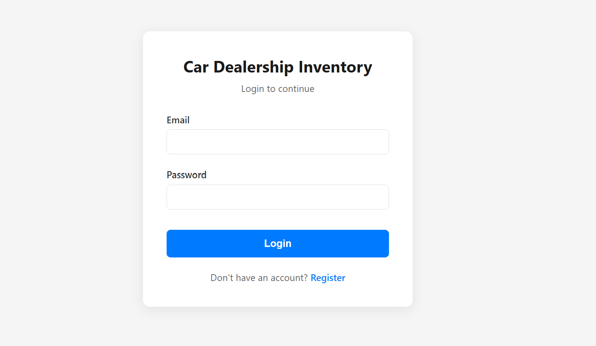
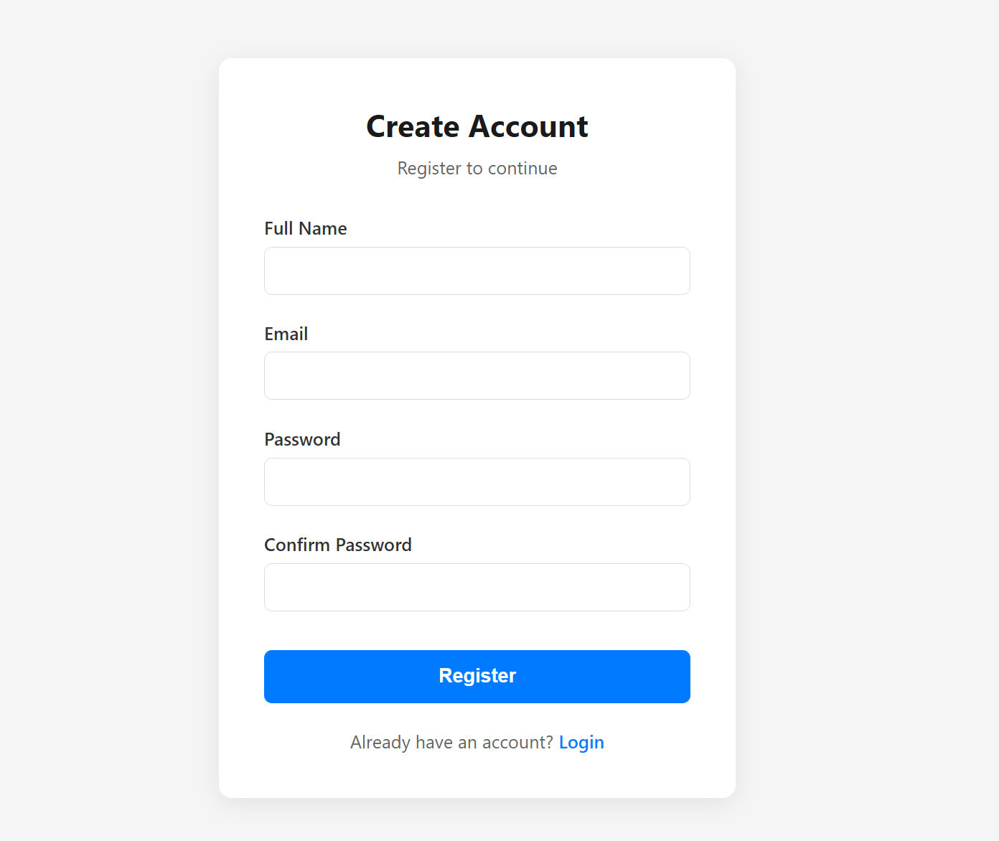
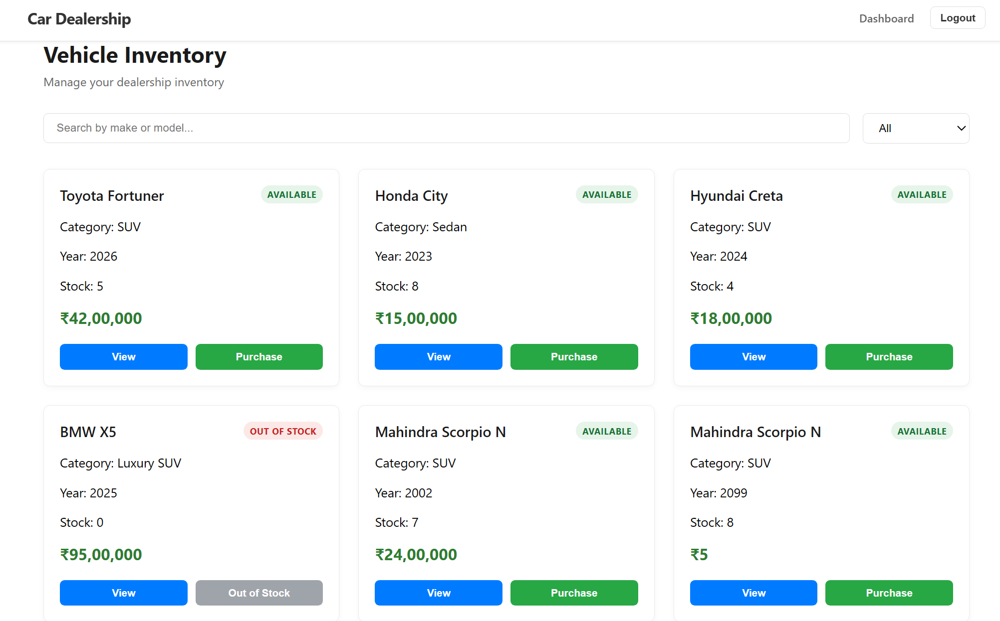
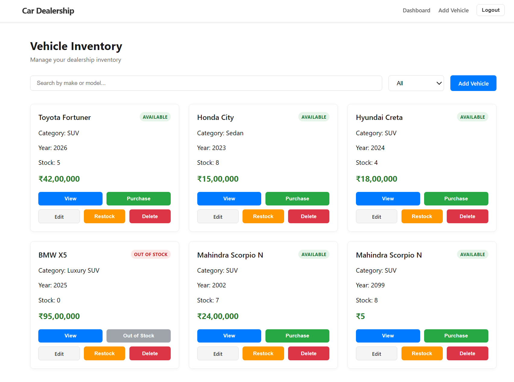
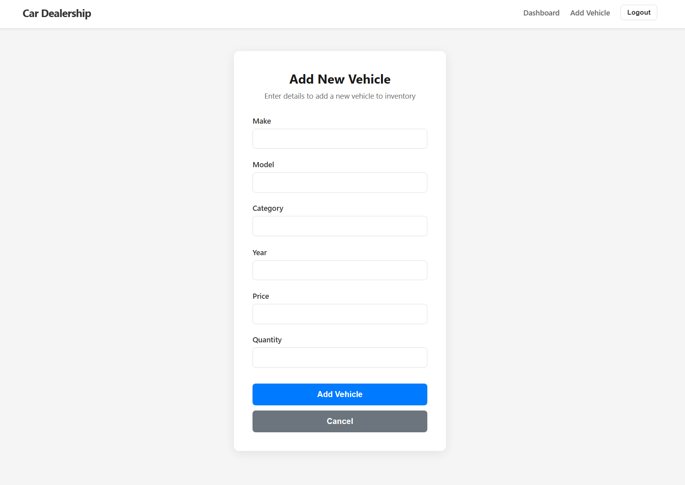
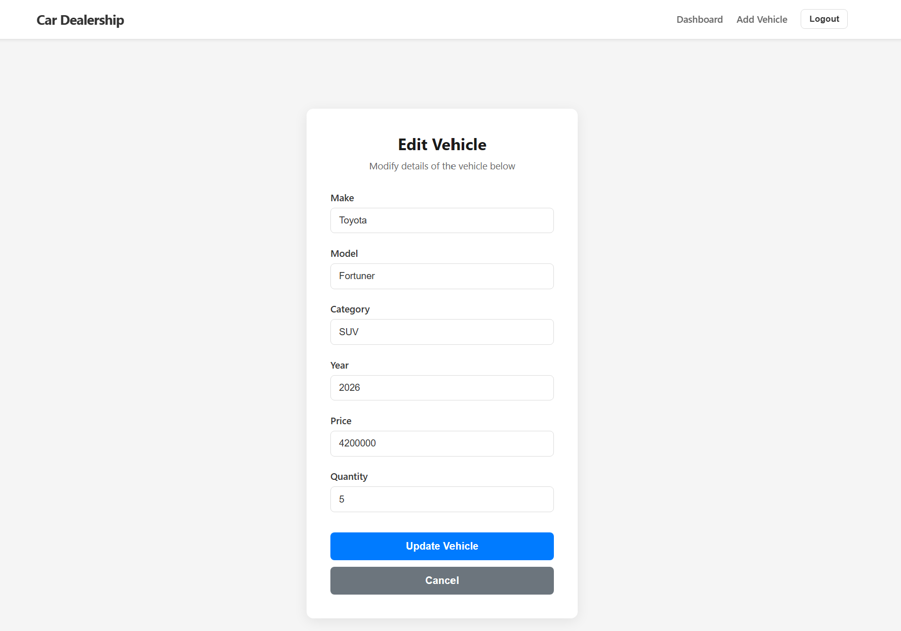
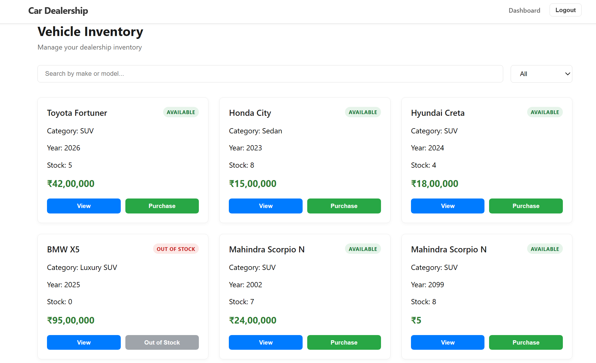

# 🚗 Car Dealership Inventory Management System

A full-stack Car Dealership Inventory Management System developed using **React**, **Spring Boot**, and **MongoDB**.

The application enables secure inventory management with JWT authentication, role-based access control, vehicle inventory management, purchasing, restocking, searching, and filtering functionality.

---

# 📌 Features

## Authentication

- User Registration
- User Login
- JWT Authentication
- Secure Protected Routes
- Logout Functionality

## Role-Based Access Control (RBAC)

### Admin
- Add Vehicle
- Edit Vehicle
- Delete Vehicle
- Restock Inventory
- Purchase Vehicle
- Search Vehicles
- Filter Vehicles

### User
- View Vehicle Inventory
- Purchase Vehicle
- Search Vehicles
- Filter Vehicles

Users cannot access admin-only pages or operations.

---

# 🚀 Tech Stack

## Frontend

- React.js
- React Router
- Axios
- CSS

## Backend

- Spring Boot
- Spring Security
- JWT Authentication
- Maven

## Database

- MongoDB

## Testing

### Frontend

- Jest
- React Testing Library

### Backend

- JUnit

---

# 📂 Project Structure

```
CarDealership
│
├── backend
│   ├── controller
│   ├── service
│   ├── repository
│   ├── model
│   ├── security
│   └── tests
│
├── frontend
│   ├── components
│   ├── pages
│   ├── services
│   ├── styles
│   └── tests
│
├── screenshots
│
└── README.md
```

---

# ⚙️ Installation

## Backend

```bash
cd backend
```

Run Spring Boot application.

Backend runs on:

```
http://localhost:8080
```

---

## Frontend

```bash
cd frontend
npm install
npm start
```

Frontend runs on:

```
http://localhost:3000
```

---

# 🔑 Test Accounts

## Admin

```
Email:
meet@test.com

Password:
test@123
```

> Ensure this user has the **ADMIN** role in MongoDB.

## User

Register a new account to access the application as a normal user.

---

# 🧪 Running Tests

## Frontend

```bash
npm test -- --watchAll=false
```

Result:

- 7 Test Suites Passed
- 41 Tests Passed

## Backend

Run the backend JUnit test classes.

All backend tests pass successfully.

---

# 📷 Application Screenshots

## Login Page



---

## Register Page



---

## User Dashboard

Features available to normal users:

- Search Vehicles
- Filter Vehicles
- Purchase Vehicles



---

## Admin Dashboard

Features available to administrators:

- Add Vehicle
- Edit Vehicle
- Delete Vehicle
- Restock Inventory
- Purchase Vehicle



---

## Add Vehicle



---

## Update Vehicle



---

## Vehicle Search



---

# 🔌 API Endpoints

## Authentication

| Method | Endpoint | Description |
|---------|----------|-------------|
| POST | `/api/auth/register` | Register a new user |
| POST | `/api/auth/login` | Login user |

---

## Vehicle Management

| Method | Endpoint | Description |
|---------|----------|-------------|
| GET | `/api/vehicles` | Get all vehicles |
| GET | `/api/vehicles/{id}` | Get vehicle by ID |
| POST | `/api/vehicles` | Add vehicle (Admin) |
| PUT | `/api/vehicles/{id}` | Update vehicle (Admin) |
| DELETE | `/api/vehicles/{id}` | Delete vehicle (Admin) |
| GET | `/api/vehicles/search` | Search vehicles |
| POST | `/api/vehicles/{id}/purchase` | Purchase vehicle |
| POST | `/api/vehicles/{id}/restock` | Restock vehicle (Admin) |

---

# 🤖 AI Usage

## AI Tools Used

- ChatGPT (OpenAI)
- Antigravity IDE AI Assistant

## How AI Was Used

AI was used to assist with:

- Planning the project architecture.
- Generating frontend and backend boilerplate code.
- Debugging Spring Boot, JWT authentication, and React integration.
- Creating unit tests.
- Improving UI layout and responsiveness.
- Resolving build and CORS issues.

All AI-generated code was manually reviewed, integrated, tested, debugged, and validated before being included in the final project.

---

# 📊 Test Summary

## Frontend

- 7 Test Suites Passed
- 41 Tests Passed

## Backend

- All JUnit test classes passed successfully.

---

# 🔮 Future Improvements

Possible future enhancements include:

- Vehicle image upload support.
- Customer purchase history.
- Pagination for large inventories.
- Email notifications.
- Advanced reporting and analytics.
- Cloud deployment.
- Docker containerization.

---

# 👨‍💻 Author

**Meet Chaudhari**

Computer Engineering Student

---

# ⭐ Acknowledgements

This project was developed as part of the Incubyte Full-Stack Developer Assessment.

Special thanks to the open-source community and the documentation of React, Spring Boot, MongoDB, and related technologies for their valuable resources.